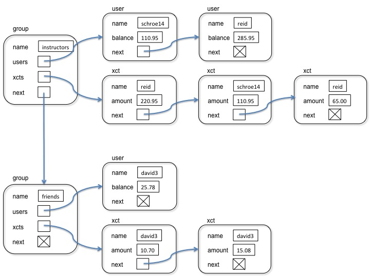

# Buxfer

## Introduction
Buxfer is a service that lets groups of people track shared expenses. For example, colleagues might want to keep track of shared lunch bills. For each expense, Buxfer records the person who paid the expense and the expense cost. It allows group members to examine the amount that individuals have paid, look at the history of all transactions, or determine the group member that is currently owing the most.

## Data Structure

A Buxfer application can manage multiple groups, and for each group must keep track of the group's members and the group's transactions (expenses paid by users). This means that we need three different data structures: the groups, the users (in a specific group), and transactions (for a specific user). It is sufficient to use linked lists to store groups, users and transactions.

The picture below shows what these data structures look like for an example with two different groups, one with two users and three transactions, and the other with one user and two transactions.

* A Group node (vertically arranged on the left in the picture above) stores the name of the group, a pointer to the first node of the User linked list in this group, a pointer to the first Transaction (xct) node for this group, and a pointer to the next Group node.

* A User node keeps track of the relevant information for a user, such as name, balance (the total expenses this person has paid), and a pointer to the next User node.

* A Transaction (xct) node keeps track of all the information about a transaction, such as the name of the user who paid for it, the amount, and a pointer to the next Transaction node.

The User lists are sorted by the user's balances, with the user with the lowest balance first in the list and the user with the highest balance last in the list. This makes it easier to find the user who has paid the least so far. 
The Transaction lists are sorted by the time when a transaction was added, with the most recent transaction first in the list. This makes it easy to output a sorted history of the transactions in a group.

## Operation Supported by Buxfer
A Buxfer application supports the following user commands.

* **add_group group_name:** Register a new group with name group_name.

* **list_groups:** List the names of all groups that are currently registered.

* **add_user group_name user_name:** Register a new user with name user_name as a member of group group_name.

* **list_users group_name:** List the names of all users of group group_name together with their current balances (i.e. how much each has paid so far), sorted by their balances (lowest payer first).

* **user_balance group_name user_name:** Return the balance of user user_name in group group_name.

* **remove_user group_name user_name:** Remove user user_name from group group_name.

* **under_paid group_name:** Output the name of the user in group group_name who has paid the least.

* **add_xct group_name user_name amount:** Add a new transaction for group group_name. The transaction is paid by user_name and the amount is amount.

* **recent_xct group_name num_xct:** List the num_xct most recent transactions for group group_name.

* **quit:** Shut down buxfer.

The buxfer executable can be started from the commandline with either zero or one argument as follows:

    ./buxfer [filename]

If buxfer is run without any arguments, it starts in interactive mode. It will display a prompt and wait for the above commands at the command line.

If run with one argument, it expects this argument to be the name of a file that contains one buxfer command per line (the commands are those from the list above) and will execute those commands from the file.

==================================================

[Return to Home Repository](../)
