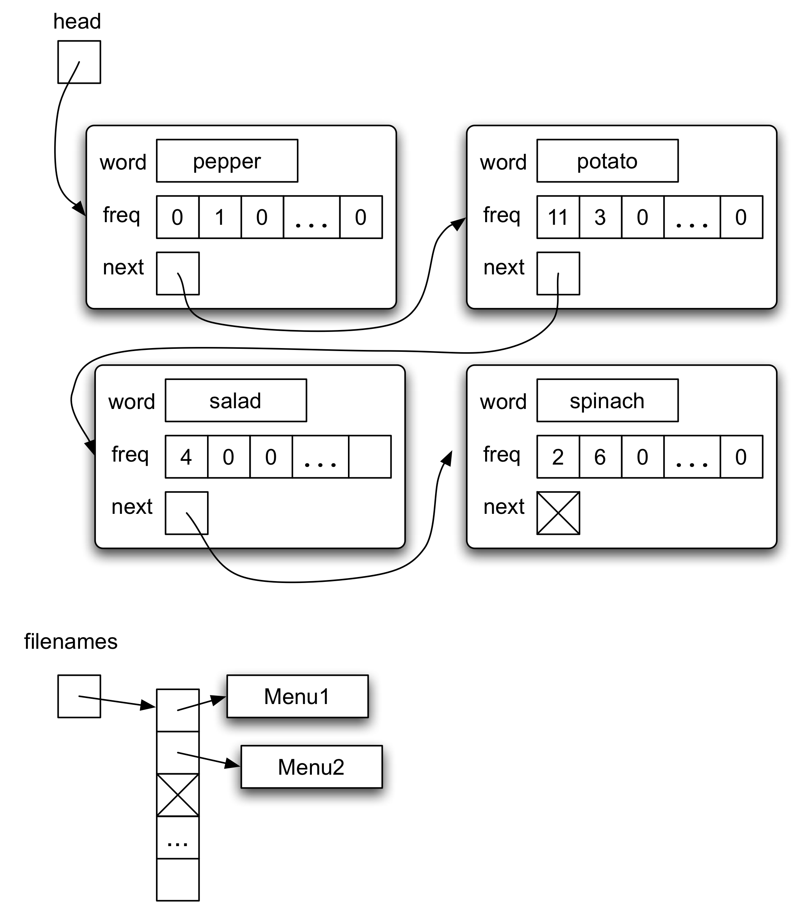

# Simple Search Engine

## Introduction

A search engine (like Google) has three main components: a crawler that finds and stores copies of files on the web, an indexer that creates a data structure that is efficient for searching, and a query engine that performs the searches requested by users. The query engine uses the indexes produced by the second component to identify documents that match the search term.

## Index Files

Each list node contains three elements: the word, an array that stores the number of times the word has been seen in each file, and a pointer to the next element of the list. Another data structure (an array of strings) stores the name of each file that is indexed. 

The index of a file name corresponds to the index of the frequency array in a list node. Storing the file names separately means that we don't need to store the name of each file many times.

* In the diagram above, four words have been extracted from two files. The two files are called "Menu1" and "Menu2". The linked list shows that the word "spinach" appears 2 times in the file Menu1 and 6 times in the file Menu2. Similarly, the word "potato" appears 11 times in the file Menu1 and 3 times in Menu2. The words in the linked list are in alphabetical order.

## Usage

Download all files under this directory, then compile the files.

Run indexer on text files to create index files.

    indexer [-i INDEX_FILE] [-n NAME_FILE] [-d DIRECTORY_NAME]

Run query or queryone.

    query [-d DIRECTORY_NAME]
    queryone [-d DIRECTORY_NAME]
